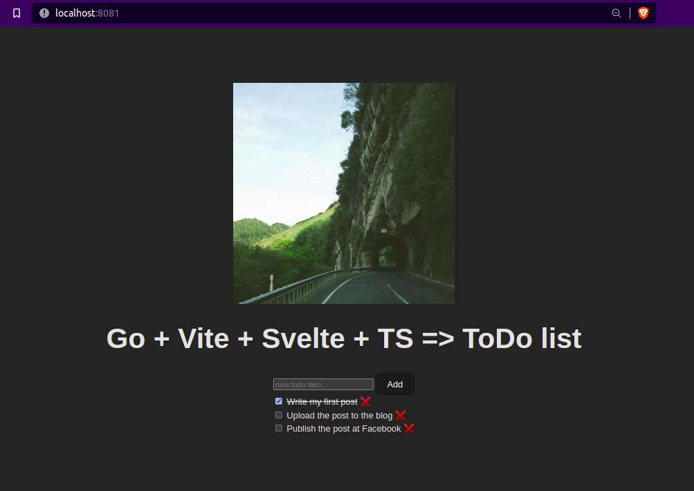

# project with images volume
This a k3d set-up to run the ToDo's project (4.web-server(project)). An agent level volume is being used to cache the images (on image/{name} endpoint)

## 1. Delete the previous deployments, services and ingress
Delete by using `kubectl delete -f {manifiests}` or check the deployment names with `$ kubectl get deployments` and services with `ubectl get svc,ing` then delete them

## 2. (If you don't have the images builded and pushed) Build, tag and push the images. 
For image building, assuming you have a cluster LB in port 8081, FE well need this port to access api endpoint
```shell
$ docker build . -t project --build-arg VITE_API_URL=http://localhost:8081
```

## 3. Run the manifests
Run the deployment
```shell
$ kubectl apply -f .
```

## 5. test
Assuming you have the k3d cluster set with a load balancer in port 8081 
```shell
$ curl localhost:8081/api/health 
{
    "status": "Healty"
}%

$ curl localhost:8081/api/todos
[]
```
Also, you should be able to access FE and cached images on `localhost:8081` (with 8081 as the cluster LB)


## 6. testing the volume
1. you can delete the deployment with `$ kubectl delete -f deployment` and then create it again. Once the api is up, previous cached images should be be returning from volume

2. deleting the project container. 
You have to get shell access to the agent and then stop/delete the project container

$ docker exec -it agent-0 sh

```shell
/ # ctr containers ls
CONTAINER                                                           IMAGE                                               RUNTIME                  
2e268e6677d0fe759ca1ffc239070ad27c473a8829779419a53bc1c6073c1d6e    docker.io/rancher/mirrored-pause:3.6                io.containerd.runc.v2    
3c6974320b942cbfb6129e3ccdad3f89b85d1f3790f57bc5e9d9e941b5f87950    k3d-myregistry.localhost:12345/project:latest       io.containerd.runc.v2    
578e84b4af6b9872f42503de9a8ca638d7a8a0408c946187bc6a75da9f7e3e3b    docker.io/rancher/klipper-lb:v0.3.4                 io.containerd.runc.v2    
81d9940082f7af651c309fb7b43cd6c5706c3369f13dc8205e66b4a97825d8f8    docker.io/rancher/mirrored-metrics-server:v0.5.2    io.containerd.runc.v2    
a4fe5e0a711b29bd573d6cb4c0014cd8e29e5186ab773633f489bdf9d2df511f    docker.io/rancher/mirrored-pause:3.6                io.containerd.runc.v2    
b431a1a9d11b093fc2b7845d75ba98aec9d27df9130e90b3a11028a0806da27f    docker.io/rancher/mirrored-pause:3.6                io.containerd.runc.v2    
b58bb5dced39bc5632a98a52c33b84bb46c900fb07fe7d102843a2c5e9d9314e    docker.io/rancher/mirrored-pause:3.6                io.containerd.runc.v2    
c7ccedb8ca34b52dc3fc869359de90731a14c3ec62b3f2ef93ec3c75f65dab2f    docker.io/rancher/mirrored-pause:3.6                io.containerd.runc.v2    
cb53763659fa8c7fc1cd0468505b7455d50de897c4a1ecc5a2cba9fedb28afce    docker.io/rancher/mirrored-metrics-server:v0.5.2    io.containerd.runc.v2    
f4b15cdfc2a0c0b43882896d43da40e9407992cf4888b20af96752fc94093d1f    docker.io/rancher/klipper-lb:v0.3.4                 io.containerd.runc.v2    
f4fc2c29dd450ca5eb1d23730c3baedbf3a2ffa0b3574650b52bda7cde2487e0    docker.io/rancher/klipper-lb:v0.3.4                 io.containerd.runc.v2    
f5d4d659aab34858b68db4a491721ebb22fef9ca498af532f1552a94290a7232    docker.io/rancher/klipper-lb:v0.3.4                 io.containerd.runc.v2    

/ # ctr task kill 3c6974320b942cbfb6129e3ccdad3f89b85d1f3790f57bc5e9d9e941b5f87950
```

In the above example I'm killing `3c6974320b942cbfb6129e3ccdad3f89b85d1f3790f57bc5e9d9e941b5f87950` task by id, since this is the `k3d-myregistry.localhost:12345/project:latest` project container id. If you're fast enough you could use `kubectl get pods` to see how the container is being restored. After this, image endpoint should be still returning cached images from volume 