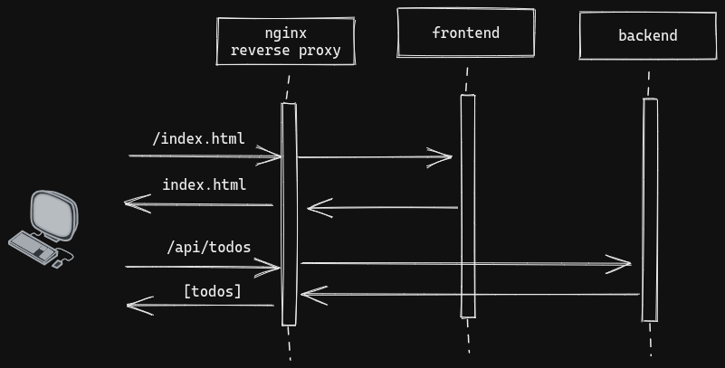
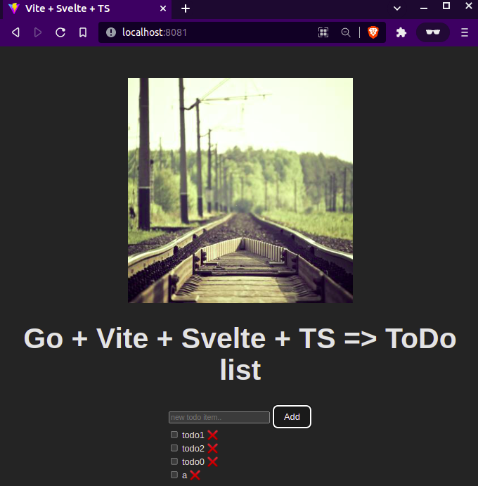

# Running the ToDo project
The Todo project includes three projects (all of them could be executed as docker containers):
1. Go API backend
2. Svelte frontend
3. Nginx reverse proxy

In order to show an exmaple of K8S pod communication, the nginx pod is configurated as a reverse proxy in charge of transfer requests to the frontend or to the backend pod respectively.



## 1. Delete previous deployments, services and ingress
Check the deployment names with `$ kubectl get deployments`, the services with `$ kubectl get svc,ing` and delete them by using their names. (or by using the manifests files: `$ kubectl delete -f ingress.yml service.yml deployment.yml`)
Or with
```shell
$ kubectl delete pods --all
$ kubectl delete svc --all 
$ kubectl delete ing --all
```

## 2. (If you don't have the images builded and pushed) Build, tag and push the images
Assuming K3D LB is on port 8081
```shell
fe $ docker build . -t project-fe --build-arg VITE_API_URL=http://localhost:8081
be $ docker build . -t project-be    
```

## 3. Run the manifests 
Run the deployment
```shell
$ kubectl apply -f .
```

## 4. test
Assuming you have your K3D LB on port 8081, open `localhost:8081/` and explore the todo list. Alternatively you can open developer tools and pods logs to see the request logging (specially on backend pod)

