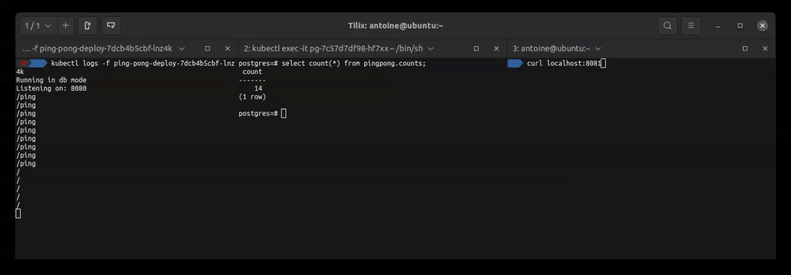

# Ping-pong as an statefulSet application
Ping-pong application saving its counts into a postgres db. The postgres is a statefulSet deployment, meaning that if the pg pod is deleted, the data is gonna persist. Additionally, db credentials are encrypted.

## 1. Delete previous deployments, services and ingress
Check the deployment names with `$ kubectl get deployments`, the services with `$ kubectl get svc,ing` and delete them by using their names. (or by using the manifests files: `$ kubectl delete -f ingress.yml service.yml deployment.yml`). Or by using `$ kubectl delete pods --all`

## 2. (If you don't have the images builded and pushed) Build, tag and push the images
Ping-pong requires two images: first one for db migrations and second one for the application itself.
- Check previous exercises to see how to build, tag and push these images to K3D local registry.

## 2. Decrypt the secrets
You'll need `age-keygen` and `sops`.
Take a look to the `secret.enc.yml` file. This is a K8S encrypted secret. You'll need a corresponding `age-keygen` public key to decrypt it.

```shell
$ export SOPS_AGE_KEY_FILE=~/key.txt 
$ sops --decrypt secret.enc.yaml > secret.yml
```

Now you should have a `secret.yml` file. 

## 3. Run the manifests 
First run the namespace manifest

```shell
$ kubectl apply -f ns.yml
```

Then the remaining manifests

```shell
$ kubectl apply -f .
```

## 4. Test
Assuming you have your K3D LB on port 8081:

```shell
$ curl localhost:8081
time: 2022-10-01 03:06:07.971999584 +0000 UTC m=+3093.413709424
Ping / Pongs: 11
```



Testing the statefulSet? If you delete the postgres pod
```shell
$ kubectl get po                    
NAME                                READY   STATUS    RESTARTS   AGE
ping-pong-deploy-5cc5cbcb9f-rgfwd   1/1     Running   0          75m
pg-ss-0                             1/1     Running   0          50m

$ kubectl delete pod pg-ss-0
pod "pg-ss-0" deleted
```

Wait some seconds and the pod will be restored by K8S. However the data on `pingpong.counts` table should be restored as well.

## Note: Encrypting a `secrets.yml` file
- Check the `.secret.yml` file

To create a `age-keygen` public key:

```shell
$ age-keygen -o key.txt
Public key: age17mgq9ygh23q0cr00mjn0dfn8msak0apdy0ymjv5k50qzy75zmfkqzjdam4
```
Then, to encrypt the secret:

```shell
$ sops --encrypt \
--age age17mgq9ygh23q0cr00mjn0dfn8msak0apdy0ymjv5k50qzy75zmfkqzjdam4 \
--encrypted-regex '^(data)$' \
secret.yaml > secret.enc.yaml
```

## Note: K8S secrets should be added as base64 encoded strings
The `data` values on a K8S secret should be base64 encoded strings. To encode this kind of string you can use:
```shell
$ echo -n "postgres" | base64
cG9zdGdyZXM=
```

