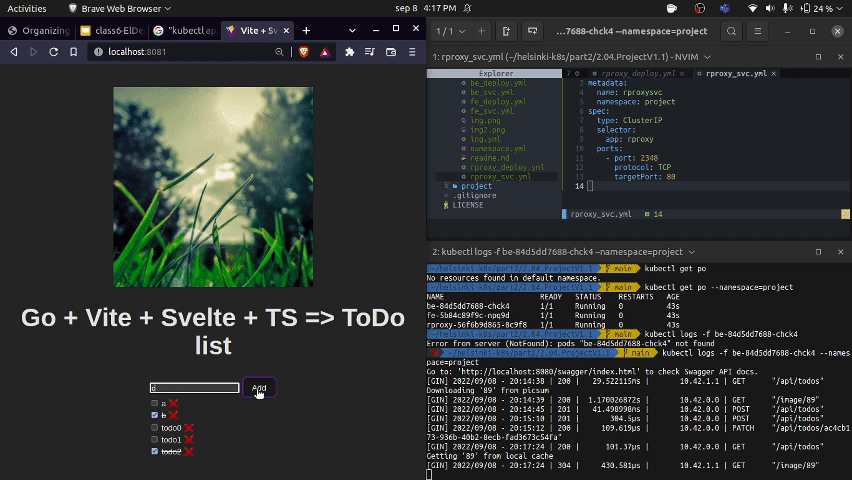

# Running the ToDo project

The Todo project includes three projects (all of them could be executed as docker containers):
1. Go API backend
2. Postgres DB
3. Svelte frontend
4. Nginx reverse proxy

- Postgres DB deployed as an statefulSet resource


## 1. Delete previous deployments, services and ingress

Check the deployment names with `$ kubectl get deployments`, the services with `$ kubectl get svc,ing` and delete them by using their names. (or by using the manifests files: `$ kubectl delete -f ingress.yml service.yml deployment.yml`). Also `$kubectl delete -f .` will work or with:

```shell
$ kubectl delete pods --all
$ kubectl delete svc --all 
$ kubectl delete ing --all
$ kubectl delete statefulset --all
```

## 2. (If you don't have the images builded and pushed) Build, tag and push the images

Assuming K3D LB is on port 8081
```shell
fe $ docker build . -t todos-fe --build-arg VITE_API_URL=http://localhost:8081
be $ docker build . -t todos-be    
rproxy $ docker build . -t todos-rproxy 
```
## 3. Decrypt the secrets

You'll need `age-keygen` and `sops`.
Take a look to the `secret.enc.yml` file. This is a K3D encrypted secret. You'll need a corresponding `age-keygen` public key to decrypt it.

```shell
$ export SOPS_AGE_KEY_FILE=~/key.txt 
$ sops --decrypt secret.enc.yaml > secret.yml
```

Now you should have a `secret.yml` file. 

## 4. Run the manifests 

```shell
$ kubectl apply -f ns.yml
$ kubectl apply -f .
```

## 4. Test

Assuming you have your K3D LB on port 8081, open `localhost:8081/` and explore the ToDo list. Alternatively you can open developer tools and pods logs to see the request logging (specially on backend pod)



Testing the statefulSet? If you delete the postgres pod

```shell
$ kubectl get po                    
NAME                                READY   STATUS    RESTARTS   AGE
todo-be-5cc5cbcb9f-rgfw             1/1     Running   0          75m
...
pg-ss-0                             1/1     Running   0          50m

$ kubectl delete pod pg-ss-0
pod "pg-ss-0" deleted
```

Wait some seconds and the pod will be restored by K3D. However the data on `todo.todos` table should be restored as well.

## Note: Encrypting a `secrets.yml` file

To create a `age-keygen` public key:

```shell
$ age-keygen -o key.txt
Public key: age17mgq9ygh23q0cr00mjn0dfn8msak0apdy0ymjv5k50qzy75zmfkqzjdam4
```
Then, to encrypt the secret:

```shell
$ sops --encrypt \
--age age17mgq9ygh23q0cr00mjn0dfn8msak0apdy0ymjv5k50qzy75zmfkqzjdam4 \
--encrypted-regex '^(data)$' \
secret.yaml > secret.enc.yaml
```

## Note: 3DD secrets should be added as base64 encoded strings

The `data` values on a K3D secret should be base64 encoded strings. To encode this kind of string you can use:

```shell
$ echo -n "postgres" | base64
cG9zdGdyZXM=
```

