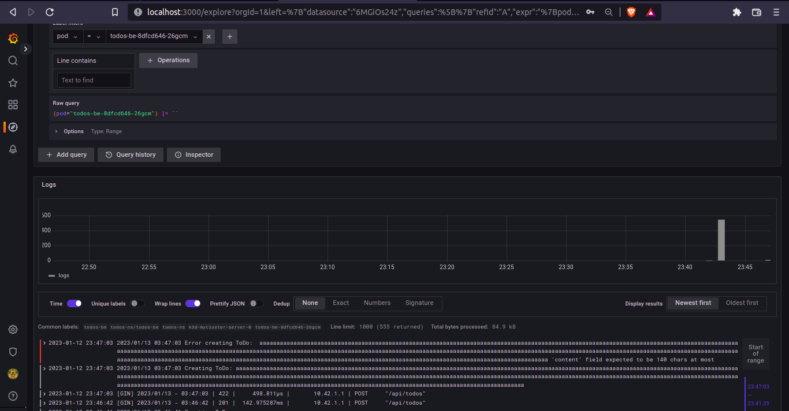

# Prometheus, grafana and loki monitoring 

To set up the project images into a local k3d cluster:

```bash

docker build . -t todos-be
docker build . -t todos-be_migrations
docker build . -t todos-fe --build-arg VITE_API_URL=http://localhost:8081
docker build . -t todos-rproxy

docker tag todos-be_migrations k3d-myregistry.localhost:12345/todos-be_migrations
docker tag todos-be k3d-myregistry.localhost:12345/todos-be           
docker tag todos-fe k3d-myregistry.localhost:12345/todos-fe
docker tag todos-rproxy k3d-myregistry.localhost:12345/todos-rproxy
docker tag postgres:14.3-alpine3.16 k3d-myregistry.localhost:12345/postgres:14.3-alpine3.16 

docker push k3d-myregistry.localhost:12345/todos-be_migrations 
docker push k3d-myregistry.localhost:12345/todos-be
docker push k3d-myregistry.localhost:12345/todos-fe
docker push k3d-myregistry.localhost:12345/todos-rproxy
docker push k3d-myregistry.localhost:12345/postgres:14.3-alpine3.16 

kubectl apply -f .

```

To install prometheus and grafana:

```bash
$ helm repo add prometheus-community https://prometheus-community.github.io/helm-charts
$ helm repo add stable https://charts.helm.sh/stable
$ kubectl create namespace prometheus
$ helm install prometheus-community/kube-prometheus-stack --generate-name --namespace prometheus
$ kubectl -n prometheus port-forward kube-prometheus-stack-1602180058-grafana-59cd48d794-4459m 3000

```

To install loki

```bash
$ kubectl create namespace loki-stack
$ helm upgrade --install loki --namespace=loki-stack grafana/loki-stack

```

Then, on localhost:3000 grafana dashboard credentials:
admin
prom-operator


check on which port is loki:
```bash
$ k get all -n loki-stack
```

then on grafana, settings, add data source: http://loki.loki-stack:3100. After selecting the backend pod you will see the backend logs.




To delete helm resources (on each ns)
```shell
$ helm list --all
$ helm delete {resource listed name}
``` 
