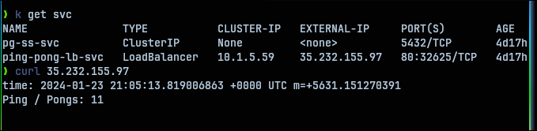

# GKE Ping Pong   

## Setting up GKE cluster   

[free-tier-gke](https://github.com/Neutrollized/free-tier-gke) was used to set-up the cluster with terraform.   

## Deploying the application   

```shell
$ kubectl apply -f ns.yaml
$ kubectl apply -f .
```

## Postgres password secret   

`secret.yaml` file only contains `postgres` not-encrypted password value.   
## Testing   

- Application should work as same as in `part2/2.07.StatefulPingPong/`. Only difference now is that GKE loadbalancer service will expose a public API we can request to:   

- `ingress` may take some minutes until getting a public ip and to conciliate services. Check `$ kubectl get ing ingress` output from time to time   



