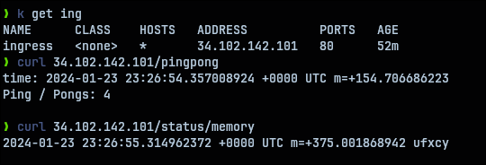

# GKE Ping Pong and log-output with ingress   

## Setting up GKE cluster   

[free-tier-gke](https://github.com/Neutrollized/free-tier-gke) was used to set-up the cluster with terraform.   

## Deploying the application   

```shell
$ kubectl apply -f ns.yaml
$ kubectl apply -f .
```

## Postgres password secret   

`secret.yaml` file only contains `postgres` not-encrypted password value.   

## Testing   



