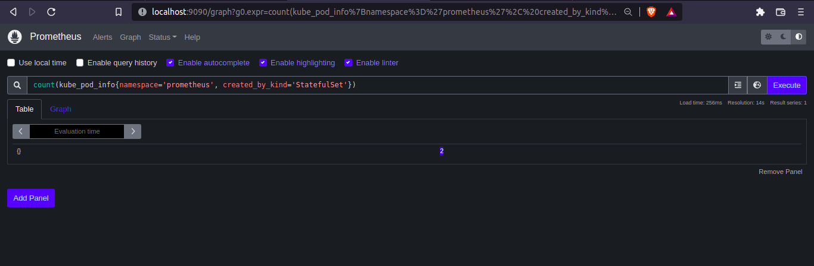

# Prometheus queries

First open a port for prometheus web interface:

```shell
$ helm install prometheus-community/kube-prometheus-stack --generate-name --namespace prometheus

$ k get po -n prometheus
NAME                                                              READY   STATUS    RESTARTS       AGE
kube-prometheus-stack-1675-operator-78567977b-559wd               1/1     Running   0              4h10m
kube-prometheus-stack-1675116557-prometheus-node-exporter-rf5n4   1/1     Running   0              4h10m
kube-prometheus-stack-1675116557-prometheus-node-exporter-lhc62   1/1     Running   0              4h10m
kube-prometheus-stack-1675116557-kube-state-metrics-565fb95f6bs   1/1     Running   0              4h10m
kube-prometheus-stack-1675116557-prometheus-node-exporter-lh5vq   1/1     Running   0              4h10m
alertmanager-kube-prometheus-stack-1675-alertmanager-0            2/2     Running   2 (4h9m ago)   4h10m
prometheus-kube-prometheus-stack-1675-prometheus-0                2/2     Running   0              4h10m
kube-prometheus-stack-1675116557-grafana-976b6468b-jtd4s          3/3     Running   0              4h10m

$ kubectl -n prometheus port-forward prometheus-kube-prometheus-stack-1675-prometheus-0 9090:9090
Forwarding from 127.0.0.1:9090 -> 9090
Forwarding from [::1]:9090 -> 9090
Handling connection for 9090
Handling connection for 9090
```

The query to get the number of pods created by StatefulSets on Prometheus namespace is: (check docs at https://github.com/kubernetes/kube-state-metrics/tree/main/docs)

```
scalar(count(kube_pod_info{namespace='prometheus', created_by_kind='StatefulSet'}))
```



