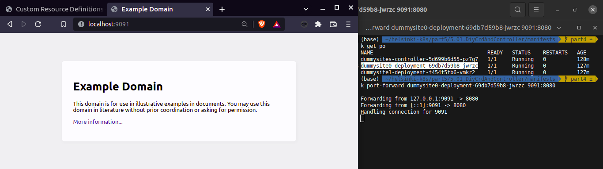

# DummySites K8S CustomResourceDefinition

- `controller/`   
   contains the code which controls the deployment/pods life cycle

- `dummysite/`   
   is the main project. Given an url, it downloads the html and serves it

- `manifests/`   
   contains the CRD manifests

1. Spin-up the cluster
This project was tested on a K3D cluster using a local image registry.

2. Build and push the images 
Build and push the images on `controller/` and `dummysite/` folders

3. Apply the crd-definition manifests:
   ```
   clusterrole-binding.yaml
   crd.yaml
   serviceaccount.yaml
   clusterrole.yaml            
   controller-deployment.yaml  
   ```

   then the resource manifests:
   ```
   dummysite.yaml
   dummysite1.yaml
   ```

4. Test
The CRD is deploying the application as K8S deployments. It's up to you to expose it (like through services).   
The fastest way to expose a DummySite application is by port-forward the pod port:

   ```shell
   $ kubectl get po
   NAME                                     READY   STATUS    RESTARTS   AGE
   dummysites-controller-5d699b6d55-pz7g7   1/1     Running   0          128m
   dummysite0-deployment-69db7d59b8-jwrzc   1/1     Running   0          127m
   dummysite1-deployment-f454f5fb6-vmkr2    1/1     Running   0          127m

   $ kubectl port-forward dummysite0-deployment-69db7d59b8-jwrzc 9091:8080

   Forwarding from 127.0.0.1:9091 -> 8080
   Forwarding from [::1]:9091 -> 8080
   Handling connection for 9091
   ```

   

5. Notes
To test a crd api:
   ```shell 
   kubectl proxy --port=8080 &
   curl http://localhost:8080/apis/stable.anth/v1/dummysites\?watch\=true
   ```

