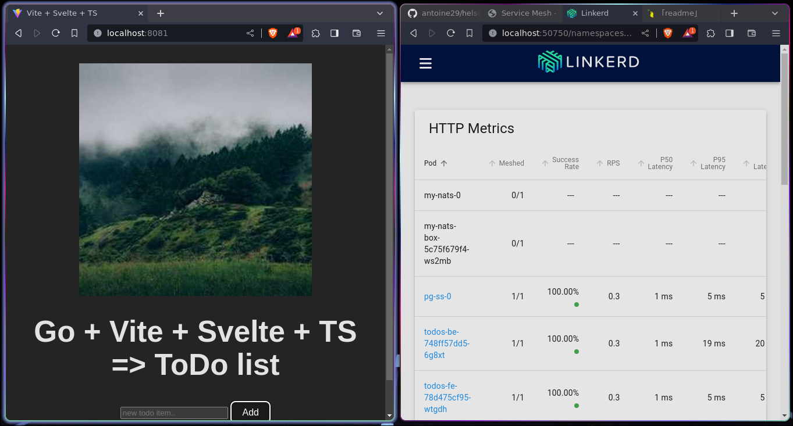

# Service mesh

- based on proyects on: `part2/project/`. You should build images for following projects:   
    - be   
    - be/dbMigrations   
    - fe   
    - rproxy   
    - todos-queue/consumer   
    - todos-queue/publisher      

## Cluster setup   

Full project was tested over K3D. Bootstrap one with following commands:

```shell
$ k3d registry create myregistry.localhost --port 12345
$ k3d cluster create mycluster --port 8082:30080@agent:0 -p 8081:80@loadbalancer --agents 2 --registry-use k3d-myregistry.localhost:12345
```

## Linkerd   

- install linkerd cli

- install linkerd viz util:

    ```shell
    $ linkerd viz install | kubectl apply -f -
    ```

    open it with:

    ```shell
    $ linkerd viz dashboard
    ```

## Helm dependencies   
```shell
$ helm repo add nats https://nats-io.github.io/k8s/helm/charts/
$ helm repo update
$ helm install my-nats nats/nats
```
## Run manifests   

```shell
$ kubectl apply -f .
```

## Testing   

Application will be accesible on host port 8081   



