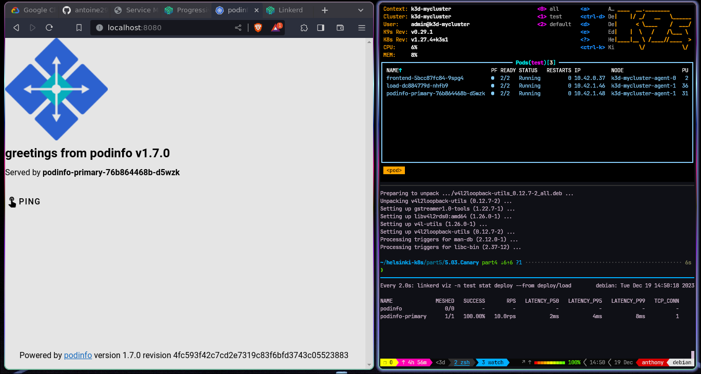

# Canary deployment

setup the project demo:   

```shell
$ kubectl apply -k github.com/fluxcd/flagger/kustomize/linkerd

$ kubectl -n flagger-system rollout status deploy/flagger

$ kubectl create ns test && \
  kubectl apply -f https://run.linkerd.io/flagger.yml

$ kubectl -n test rollout status deploy podinfo

$ kubectl -n test port-forward svc/frontend 8080
```

trigger an update:   

```shell
$ kubectl -n test set image deployment/podinfo \
  podinfod=quay.io/stefanprodan/podinfo:1.7.1
```

look at the traffic changes:

```shell
kubectl -n test get httproute.gateway.networking.k8s.io podinfo -o yaml
# or
watch linkerd viz -n test stat deploy --from deploy/load
```



