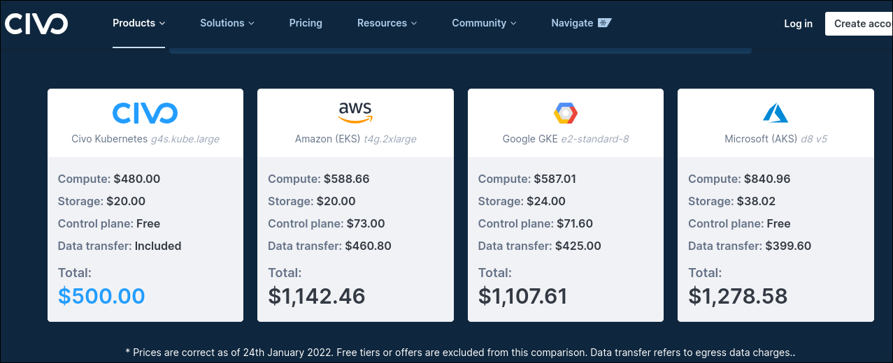
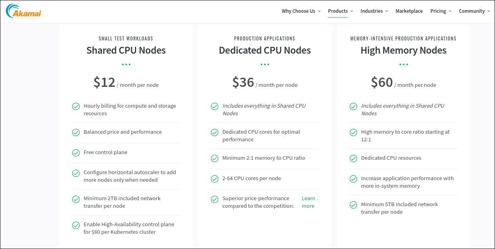
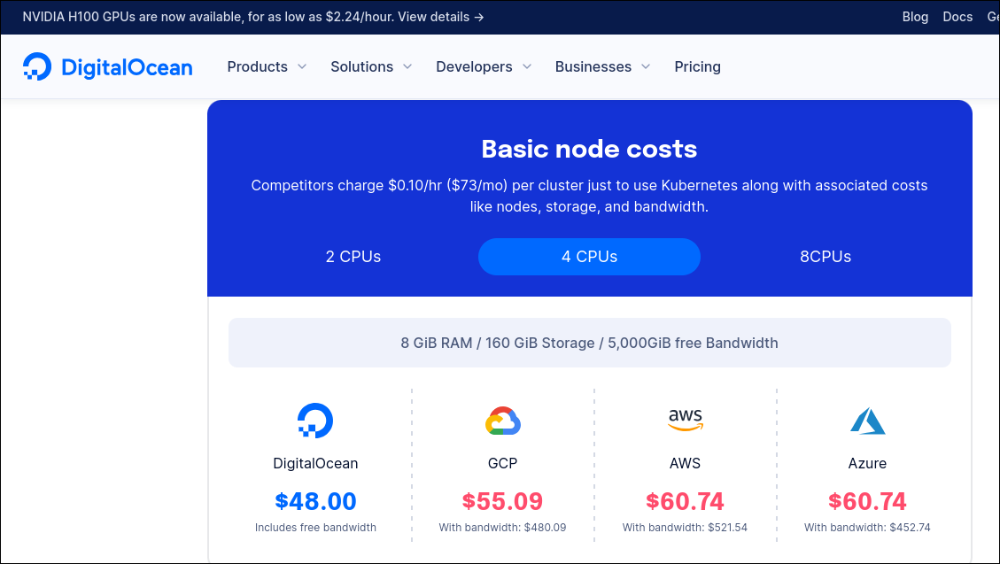

# K8S Platform/services comparisons

There are a lot of K8S-as-service providers out there. The main and biggest ones are the tech-giants providers as amazon EKS, google GKS and azure AKS. These providers gained a name and space on the market due to its velocity at putting its services available, global availavility and reliability. Such features are usually offered at high prices, commonly to big customers or enterprises.   

From a student, start-up or not-soo big customer perspective, it would make more sense to explore some other minor providers, which might provide similar features at lower prices.

- ## Civo  
    Civo claims to offer services based or powered only by kubernetes. Hence its K8S service feels native and pure.   
    - It's a relativelly new and small provider and might not offer the same reliance as other providers   
    - It has the lower prices of the three options on this comparison   
    - It offers some nice deals like free control plane instances and free traffic   
    - CNCF certified   
     

- ## Linode (now Akamai)   
    Linode (recently purchased by Akamai) is a mid size and known provider. At first glance, its page shows much more information and available services.   
    - No management fees   
    - Free control plane planes. Upgradable to higher capacities with aditional fees   
    - CNCF certified
     

- ## Digital Ocean   
    Digital ocean is a well known cloud provider. In the past, I used its dropplets service (on-demand vms) and it was a nice and reliable service

    - It focuses on availavility
    - It still offers better prices than aws, gcp or azure
    - CNCF certified

    

## Conclusion

For a learning or small/start-up project I would definitely pick **Digital Ocean** service. It offers similar features as in big providers, with lower prices. Besides I already have experience with this provider and I know it offers a good and reliable service.   
Civo would be also a good option for a ProofOfConcept like project or only for testing purpouses. 

